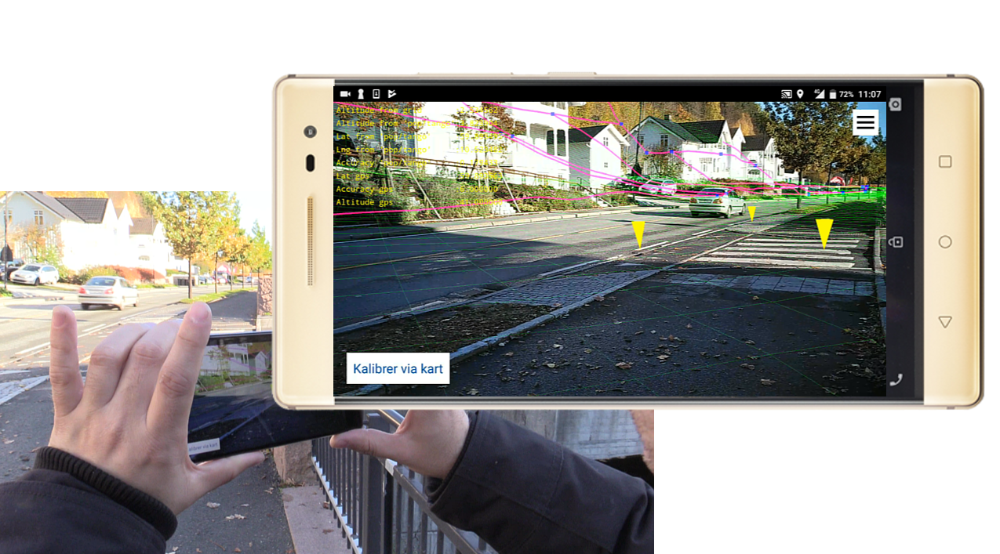

# BorderGo
This code repo contains the sourcecode of an experimental android app utilizing the Tango Augmented reality platform. The Norwegian Map Authority ([Kartverket](http://www.kartverket.no)) initiated the project, financed the development as well as providing access to public datasets. Norkart AS was given the assignment to develop a working solution and implement the code for the app.

The specific purpose of the experiment is to attempt to syncronize the Tango Coordinate system with the real geographical location and compass orientation to be able to display the cadestral borders (land properties) directly on the physical terrain as seen through the AR camera view on an Android smartphone. 

Since the Tango API only provides a local coordinate system out of the box this experimental app provides an innovative and generally useful approach to the problem of syncronizing a local AR coordinate system with the geographical positions and orientaionts. This functionality is wrapped in the "positionorientation" library.

## Using the app
This is a prototype app and the GUI doesn't provide all the guidance for using it and have norwegian texts. For best results please follow the procedure given here when using it.




Before you start:
* Make sure GPS is turned on
* Make sure you have a stable internet connection.
* Remember to completely shut down the app when not using it as it will run in the backround and drain the battery.

### Procedure
1. Hold the phone horizontally
2. Start the app.
3. Grant the needed permissions to the app if not previously granted.
4. Wait until you see the live camera image (this is the AR view), then walk around for a few moments
   * Walking around will let the app gather gps and compass meassurements at different locations. You will see the yellow info-text start to update.
   * When the gps position is accurate enough the app will download a terrain model (height-grid) for the area near the user and display it as a green wirframe in the AR view. Each square in the grid is 1x1 meters in north/east directions.
   * After the terrain model is loaded the app will download boundaries near the user and wrap them on the terrain model. The registered points along the boundaries are blue dots, while the interpolated lines between are pink/magenta lines.
4. Take a look at terrain visualization and see if it starts to stabilize
   * If the terrain is far below or above your altitude you can direct the phone at the ground and press the screen to use depth sensor data to make a better prediction of your altitude relative to the terrain model. 
   * The terrain matching algorithm is also capable of assisting in 2D calibration. Capture terrain point as described above from sloping terrain, preferably taking several observations from terrain sloping in different directions (north, east etc...)
5. __2d map calibration:__ To enable higher precision and stabilize the syncronization you should provide 3 positions with 2d map calibration. To start the process position yourself by a prominent feature visible on the ground. When you are there press the __"Kalibrer via kart"__-button at the bottom left of the screen. It will probably take a while but dont press the button more than once. When the 2d-map view appears you see if the feature is also visible in the map.If you can find the position you are at then drag the map so that the crosshair matches your location at the feature and press the __"Angi min posisjon"__-button (Eng:"Provide my position") at the bottom right of the mapview. Repeat this until you have provided 3 positions that are at least a few meters apart from eachother. Dont make abroupt movements or cover the camera of the phone while moving between the positions to make sure the app will not loose tracking. __The app will stop using GPS and compass when 3 positions hav been provided by the user.__ This prevents imprecise and biased gps and compass meassurements from disturbing the presumably more accurate syncronization achieved through 2d-map calibration.
   * If you cannot find the feature in the aerial map you can see if other prominent features near you are visible and position yourself there instead.
   * If no sufficiently prominent features are visible in the aerial map you can switch to a regular map by clicking the __"Vis grunnkart"__-button in the top left of the map view and maybe and see if that gives you useful features to register your position at
6. Go back to AR view to verify your provided positions. Your provided positions will appear as bright yellow upside down cones about half a meter tall. See if your provided positions are positioned near the place you stood when you registered them. You can expect the registrations to have an accuracy of about 0.5-1.0 meters. 
   * If they don't come close enough you can either try to register additional points or you can clear previous registrations and start the process from scratch.
   
### Other features
If you click the menu button a side menu will be shown. 

Here you will be able to:
* Adjust settings for
    * Device height above ground ("Høydeforskyvning mobilenhet")
    * Meassurement error for terrain model ("Usikkerhet høydemodell")
    * Meassurement error for map-calibration ("Usikkerhet kartkalibrering")
    * Meassurement error of depth sensor ("Usikkerhet avstandssensor")
* Reset settings to default ("Tilbakestill instillinger")
* Open the data view to inspect the data being logged by the application.
    * In the data view you get a list of the logged values and you can choose to view the graph or save the data to to the device disk (textfile)
* Toggle the visibility of the yellow info text in the top-right corner ("Skjul måleverdier")
* Toggle the hidden line removal for the terrain model ("Høydegrid: vis bakside")

#### About the yellow info-text
Being a research app it has been useful to get a live view of meassured and calculated values from the app. For this purpose we have put a section of yellow info-text in the top left corner of the screen.

The values listed are:
* __Altitude from grid:__ The altidude of the user calculated with bilinear interpolation based on the estimated geographical location relative to the digital terrain model (height grid)
* __Altitude from 'pop/tango':__ The estimated altidude as calculated by the PositionOrientationProvider (pop)
* __Lat from 'pop/tango':__ The estimated latidude as calculated by the PositionOrientationProvider (pop)
* __Lng from 'pop/tango':__ The estimated longitude as calculated by the PositionOrientationProvider (pop)
* __Accuracy from 'pop/tango':__ The estimated error/accuracy as calculated by the PositionOrientationProvider (pop)
* __Lat gps:__ The latitude provided by the mobile GPS service
* __Lng gps:__ The longitude provided by the mobile GPS service
* __Accuracy gps:__ The accuracy of lat/lng values stated by the mobile GPS service

   

## Architecture
We have composed the source as a main app wich relies on several reusable libraries. The mainApp contains the code for the views in the app as well as an Application class called __BorderGoApp__ that spans the views and maintains the global state and a custom config-manager that reads and makes configuration strings available througout the app. But for the research purpose of this app the most central class is the ___TangoService___ wich connects to the __Tango api, GPS, compass__ and provides inputs from these sources to the __positionorientation library__ wich in turn attemts to achieve a useful geograpical syncronization. Also it provides direct access to the running instance of the positionorientation provider for such things as the the map based calibration.

## Reuseable libraries:
* positionorientation
* geodesy
* data
* geometry
* glrenderer

### Positionorientation library
Provides position and orientation information for the application. The Tango system uses various 
device sensors (camera, distance sensors, acceleration/rotation sensors etc...) to find the device 
position in relation to the environment, and build a geometrical model of the environment. 

The device and environment positions are determined in a local coordinate system with the x and y 
axis in the horizontal plane, and the z axis towards zenith. The position of the origin and the 
horizontal orientation of the coordinate system is determined my the device position and orientation 
when Tango si initialized.

By using data from external sensors the local Tango coordiante system can be placed and oriented in 
relation to a global (geographic) coordinate system. For an initial determination of the position and 
orientation parameters data from the devices compass and GPS may be added through the 
__handleRotationVectorObservation(float[])__ and __handleLocationObservation(Location)__ methods.

For further refinement manual observations may be added by pointing in a map or using the Tango point 
cloud sensor for matching against a terrain model. For this purpose you would use the 
__handlePointCloudObservation(int numPoints, FloatBuffer points, DTMGrid grid, float cloud_accuracy)__ method.

In this application we have also decided to let the user point out their current location on a 2d 
map to proivde observations that tend to be far more accurate than the device GPS.

The library contains mostly generic functions and interfaces that could be utilized for similar 
purposes but where no Tango API is used. The __KalmanFilter__ and the __Transform__ classes as well 
as the __PositionOrientationProvider__ and __OriginUpdateListener__ 
interfaces are to a large degree independent of platform, but would need some changes when using an 
AR system that allows the numerical coordinates of a physical point to change as the device builds 
its model of the surroundings.

The __KalmanFilter__ is used for filtering the device position in the Tango coordinate system. As a 
by-product it computes the speed and direction of motion. Actually in hindsight, using a Kalman filter 
for this is most probably an overkill, and a simpler filter could have been sufficient.

The __Transform__ class is used for computing the transform parameters for the coordinate transform 
between the Tango and the external geographical coordinate system. Currently it uses a three 
dimensional translation and a rotation in the horizontal plane. The parameters are computed by a least 
squares adjustment fusing all available data from Tango device tracking, GPS, compass, Tango point 
cloud and manual map calibration. The various observations are weighted by their expected quality in 
the usual way (as weight equal to the inverse apriori variance). Gross errors are eliminated by the 
application of a variant of "the danish method" for systematic downweighting of observations with 
large deviations from their estimated "ideal" value. The adjustment procedure is re-run periodically 
as new observations are added.

As the OpenGL graphics system is unable to handle coordinates of more than approx. 6 digits of precision 
geographical coordinates should be transformed to a local origin to reduce the required number of 
significant digits. The first valid geographical position observation will be used as a local origin, 
and all geographical data that should be displayed in the 3D view should use this local origin as a 
basis for generating 3D coordinates. They should implement the __OriginUpdateListener__ interface and 
register to the __PositionOrientationProvider__ to get information about the local origin. This local 
origin is in the current implementation also used by classes loading geographical data to get information 
for which area they should load data.

In the current implementation the origin is initialized as soon as the application receives a valid 
3D geographical position, and all registered OriginUpdateListeners are called. This is currently only 
done once, giving a fairly limited area of coverage. In future developments we could reinitialize the origin 
to a new position as the user reaches the limits of the area covered by the data loaded, to force 
loading of more data. 

### Geodesy library
This library handles geodetic calculations, such as transforming coordinates between coordinate systems, determining the height of the Geoid at the users location. Theese methods are available in the Geodesy class. The library also contains the OriginData class wich is used to perform the transformations bewteen the local coordinate system and the geographic location and orientation.

### Data library
Is a utility library for both logging datastreams and retrieving data from services such as the border data, height grid and access token for the orthophoto. Also it provides a way to store the logs to files on the device for later analysis. 

### Geometry library
Contains basic classes for storing geometric objects such as points, polylines, triangles and meshes

### Glrenderer library
A very basic wrapper around OpenGL to add  geometries to a scene and provide ways to control the visual rendering appearance of those geometries on a GlSurfaceView. The purpose of this library was to have a lightweight way to visualize geometry in the app without having to rely on a large third party scene graph.

## System sketch/ dataflows


### Sequential steps:
__0)__ App starts from homescreen and enters SplashActivity __1)__ BorderGoApp is instantiated __2)__ Config is instantiated and put into BorderGoApp __3)__ Permissions are requested from the user __4)__ Checks if permissions were granted __5)__ If granted MainActivity is started

### Data flows:
__A)__ Geodetic height data based on location are requested, transforms between coordianate systems are performed. 
__B)__ The positionOrientation provider is given GPS locations, compass orientations, point cloud data and tango coordinates from the TangoService, it sends origin updates to origin update listeners (in MainView). 
__C)__ TangoService sets up as an independent service running independently from the UI thread and connects with the TangoAPI,  GPS and compass serivces. It also instantiates TangoPositionOriantationProvider from the PositionOrientation library and gives direct access to it via a getter. Importantly it lets the main view register a FrameListener to inform the Main View when it is time to update the Renderer. 
__D)__ The glrenderer has an ArScene- and a ArGlRenderer-class that where the MainView can store and visualize all the geometric objects that are seen in the ar-view. The renderer triggers a RenderCallback from the MainView to do preparation steps (preRender)  before each frame is rendered.
__E)__ The MainView asks web-services for the terrain model (height grid) and the cadestral boundaries via the Repository in the data library.
__F)__ The MainView and other classes logs a number of parameters continously including gps and tango positions and accuracies
__G)__ MainView starts the DataActivity (not really a data flow)
__H)__ MainView sends the esimated current location to the MapView
__I)__ The MapView sends the user provided lcoations tot the positionOrientationProvider
__J)__ The DataActivity asks the DataLogger for a list of the logged data sets and fetces the datasets for chart display or triggers save to disk in the DataLogger on a set of logged data.


## Before you build
### Config file
In the __assets folder__ in the main app source you will find the __"config_strings.txt"__ where you will need to provide urls to services, tokens, usernames and passwords in a basic key/value syntax with __one pair for each line__ and __":::"__ as a __separator token__. If you work on a public repository and must avoid sharing the config data you can alternatively provide the data to your app by creating an uncommitted local file in you dev environment with the name __"debug_config_strings.txt"__. If it is present our custom config manager will read it after "config_strings.txt" and __trump the previous key/values.__

#### Syntax with example:
Both the key and the value will be read from the first non-whitespace character to the last non-whitespace character and any leading or trailing whitespace will be trimmed away.

Example:
```
thisIsAKey          ::: thisIsAValue
THIS_IS_A_KEY       ::: This is also a value
This is another key ::: This is another value
pretendPassword     ::: Y32X%£lFipG8
  Doesn't need to align     :::Doesnt't need particular spacing
```

### Configure access to public data sources
This app relies on a number of services at Kartverket as well as a temporary service from Norkart AS. The borders are fetched from a WFS, the height grid is fetched from a height-service and the ortho/base tiles for the map-calibration view  fetches tiles from mapservers using the Google Maps tile-request format. Notice that in __BASE_WMS_SERVICE_URL__ wich is a freely available is in a template form wher __%d__  is used as placeholders for the X,Y and zoom parameters so that one can use __String.format(mapServiceUrlTemplateNormal, x, y, zoom);__ to dynamically fill inn the correct values for each tile reqeust. 

The Orhto url template would need an extra string placeholder (__%s__) for the sessionkey. This sessionkey is fetched with a token key from a gatekeeper method under a service at (https://norgeskart.no):

```java 
public interface GateKeeperApi {
    @GET("ws/gatekeeper.py")
    Call<String> getSessionKey(@Query("key") String token);
}
```

#### The current key/values that needs to be in config_strings for the app to work. 
```
KARTVERKET_NORGESKART_URL       ::: https://norgeskart.no/
KARTVERKET_TOKEN_KEY            ::: < contact Kartverket for this token, the token is needed for their ortho wms service  >
BASE_WMS_SERVICE_URL            ::: http://opencache.statkart.no/gatekeeper/gk/gk.open_gmaps?layers=norges_grunnkart&X=%d&Y=%d&zoom=%d
ORTHO_WMS_SERVICE_URL           ::: < contact Kartverket for URL >
WFS_BASE_URL                    ::: < contact Kartverket for URL >
WFS_USER                        ::: < contact Kartverket for user >
WFS_PASSWRD                     ::: < contact Kartverket for password >
HEIGHT_SERVICE_URL              ::: < contact Kartverket or Norkart for URL >
```
Contact Kartverket to get the required urls, tokens and users

### Google maps service
The map used for map-calibration is a Google map component. To be able to use that component you need to get a __"google_maps_key"__ that you have to put into the __"google_maps_api.xml"__ file that you find in the res/values/ folder of the app project. You will find instructions inside the xml-file.

## JavaDoc:

Todo: Enable viewing of JavaDoc using github when repositoriy is public: 
The docs are  in this folder already: https://github.com/kartverket/BorderGo/tree/master/Docs


